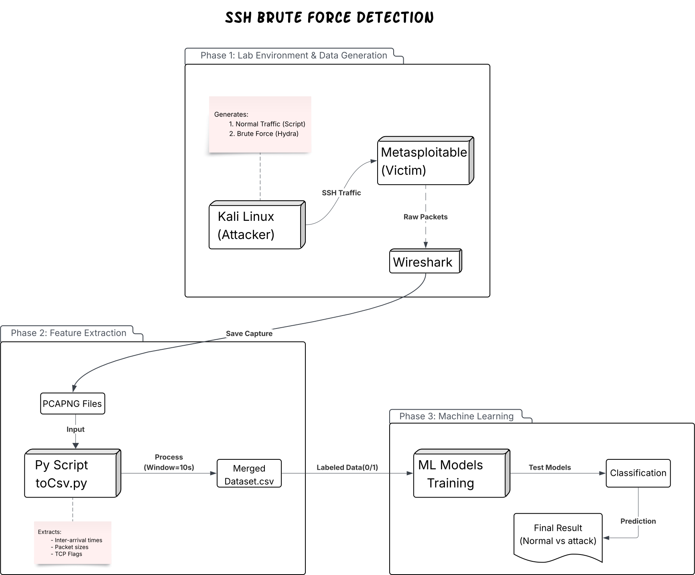

# SSH-Brute-Force-Attack
This project aims to build a machine learning model capable of distinguishing between legitimate SSH administrative traffic and malicious brute-force attacks.


[](#prerequisites)
[](LICENSE)
[](#)

A practical ML pipeline to **detect SSH brute-force attacks** by learning the difference between **legitimate administrative SSH sessions** and **automated attack traffic** using **flow-based statistical features** extracted from packet captures.

---

## Overview / Abstract

SSH brute-force attacks remain one of the most common and persistent threats against exposed infrastructure. Traditional rule-based detection can be brittle (e.g., attackers throttling attempts or rotating sources). **SSH-BF-Hunter** addresses this by building a **supervised machine learning classifier** that distinguishes:

- **Normal SSH administration traffic** (human-like interaction, varied commands, pauses)
- **Attack traffic** (automated high-rate login attempts, repetitive patterns)

The core idea is to perform **network-flow feature extraction** from captured traffic (`.pcap/.pcapng`), transform it into a labeled dataset (`.csv`), then train and evaluate multiple ML models (e.g., **Random Forest**, **SVM**, **Logistic Regression**) to classify flows as **Normal (0)** or **Attack (1)**.

---

## Architecture / Workflow Diagram




**High-level pipeline:**  
**Lab Setup → Wireshark Capture → Python Feature Extraction → CSV Dataset → ML Training & Evaluation**

---

## 🔍 Feature Set (Final & Production-Grade)

The following features are **window-based**, **encryption-safe**, and **attack-proven**:

| Feature | Description |
|------|-------------|
| mean_inter_arrival | Average packet inter-arrival time |
| std_inter_arrival | Variability in packet timing |
| burstiness | Traffic burst behavior |
| syn_count | TCP SYN packets |
| rst_count | TCP RST packets |
| syn_ratio | SYN packets / total |
| rst_ratio | RST packets / total |
| zero_payload_ratio | Zero-payload packet ratio |
| flow_count_per_window | New flows per time window |

---

## 📂 Repository Structure

```
ssh-bruteforce-ml-ids/
│
├── Data/
│   └── train_dataset1.csv       
│
├── Model/ 
│   └── model.ipynb            
│
├── Scripts/
│   ├── merge.py       
│   └── csv.py
│
├── ssh_ids_model.pkl 
├── live_ssh_ids_ml.py 
├── Dockerfile 
├── docker-compose.yml
├── .gitignore
├── requirements.txt
├── LICENSE
└── README.md
```

---

## Prerequisites

### Lab / Environment
- **VirtualBox** or **VMware**
- **Kali Linux** (Attacker / Traffic Generator)
- **Metasploitable** (Victim / Target)
- A reachable network between VMs (Host-Only / NAT Network as appropriate)

### Tooling
- **Python 3.x**
- **Wireshark** (or `tshark`) for packet capture (`.pcap`, `.pcapng`)

### Python Libraries
Typical dependencies include:
- `pandas`
- `numpy`
- `scikit-learn`
- `joblib`

(Install via `requirements.txt` in the next section.)

---

## Installation & Setup

```bash
git clone https://github.com/emaDRabie/SSH-Brute-Force-Attack.git
cd SSH-Brute-Force-Attack
``` 

---

🚨 Deploy IDS Locally (Victim / Target):

---

1. Install Docker and Docker Compose from: 
```text
https://docs.docker.com/engine/install/
```
2. Run Docker compose
```bash
docker compose up --build
```
3. Monitoring the log file
```bash
docker logs -f ssh-ids-ml
```
4. Stop IDS
```bash
docker compose down
```

---

Create and activate a virtual environment:

```bash
python3 -m venv .venv
source .venv/bin/activate
```

Install dependencies:

```bash
pip install -r requirements.txt
```

---

## Usage Workflow (Step-by-Step)

This section mirrors the end-to-end workflow used to produce labeled training data and build models.

### Step 1 — Generate Normal SSH Traffic (Benign Administration)
1. Start **Metasploitable** (victim) and ensure SSH is reachable from **Kali**.
2. Generate “human-like” SSH activity:
   - Mix of commands (filesystem navigation, process checks, editing files, etc.)
   - Natural delays between commands
3. If your repo includes automation for this, run the **normal traffic automation script** (example placeholder):

```bash
python3 scripts/generate_normal_traffic.py --host <victim-ip> --user <user> --duration 10m
```

4. Capture traffic with Wireshark on the relevant interface and save as:
   - `captures/normal_01.pcapng`

**Output:** One or more PCAP/PCAPNG files representing **benign SSH behavior**.

---

### Step 2 — Generate Attack Traffic (SSH Brute Force)
1. From **Kali**, run an automated brute-force tool (e.g., **Hydra** or Metasploit modules) against the victim SSH service.
2. Capture the attack session with Wireshark and save as:
   - `captures/attack_01.pcapng`

Example (Hydra placeholder command):

```bash
hydra -l <user> -P <wordlist.txt> ssh://<victim-ip> -t 4 -V
```

**Output:** PCAP/PCAPNG files representing **brute-force behavior**.

---

### Step 3 — Convert PCAP → CSV Feature Dataset
Use the project’s Python feature extraction script to transform packet captures into **flow-based records** with statistical features.

Example command (as required):

```bash
python3 scripts/toCsv.py input.pcap output.csv 10 <label>
```

Where:
- `input.pcap` = your capture file (`.pcap` / `.pcapng`)
- `output.csv` = generated dataset file
- `10` = time window (example: **10 seconds**) for window-based statistics
- `<label>` = `0` for Normal, `1` for Attack

Examples:

```bash
python3 scripts/toCsv.py captures/normal_01.pcapng data/normal_01.csv 10 0
python3 scripts/toCsv.py captures/attack_01.pcapng data/attack_01.csv 10 1
```

**Typical extracted features include (non-exhaustive):**
- Packet counts (per flow / per time window)
- Flow duration
- Total bytes (sent/received)
- Mean inter-arrival time (IAT) and other IAT statistics
- Window-based aggregations (rate/volume/statistics)

---

### Step 4 — Merge Datasets (Normal + Attack)
Combine all labeled CSV files into one dataset for training.

Example (placeholder script name):

```bash
python3 scripts/merge_datasets.py --input data/ --output data/dataset.csv
```

At the end of this step you should have:

- `data/dataset.csv` containing both classes:
  - `label = 0` → Normal
  - `label = 1` → Attack

---

### Step 5 — Train & Evaluate Machine Learning Models
Train supervised classifiers on the extracted features and evaluate performance.

Example (placeholder training entrypoint):

```bash
python3 train.py --data data/dataset.csv --model random_forest --test-size 0.2 --seed 42
```

Recommended evaluation outputs:
- Confusion matrix
- Precision / Recall / F1-score
- ROC-AUC (optional, if probabilities are available)
- Model artifact saving (e.g., `models/best_model.pkl`)

---

## Methodology (Brief)

### Feature Engineering
This project uses a **flow-based statistical approach**:
- Aggregate packets into flows and/or fixed **time windows** (e.g., 10 seconds)
- Compute traffic statistics (counts, bytes, rates, inter-arrival time metrics)
- Use those features as input to supervised ML models

This design aims to capture behavior differences such as:
- **Repetition & high-rate attempts** typical of brute-force tools
- **Irregular timing & command-driven interaction** typical of humans

### Models
Supervised classifiers under evaluation may include:
- **Random Forest**
- **Support Vector Machine (SVM)**
- **Logistic Regression**

---

## Visualizations & Performance

This section contains **placeholders** for plots you will add later. Replace the image paths and keep captions aligned with your final results.

### Visualization 1 — Class Balance Graph (Placeholder)
> Shows the number of samples in each class (**Normal vs Attack**). This is critical to understand whether the dataset is imbalanced and whether techniques like stratified splits, class weights, or resampling are needed.


---

### Visualization 2 — Confusion Matrix (Best Model) (Placeholder)
> Displays **True Positives / True Negatives / False Positives / False Negatives** for the best-performing model. This directly reflects how well the model detects brute-force traffic without over-flagging legitimate administrative sessions.


---

### Visualization 3 — Feature Importance Plot (Placeholder)
> Highlights which engineered features contributed most to detection (e.g., **mean inter-arrival time**, **packet rate**, **total bytes**, **window-based counts**). This improves interpretability and helps validate the model’s behavior against expected SSH brute-force patterns.


---

## Future Scope

Potential extensions and improvements:
- **Real-time detection**: streaming feature extraction + live classification (e.g., `tshark`/Zeek pipeline)
- **Deep learning approaches**: sequence models for timing patterns or representation learning on flows
- **Generalization testing**: validate across different SSH servers, networks, and attacker tool configurations
- **Adversary robustness**: evaluate against throttled/low-and-slow brute-force attempts
- **Deployment**: export model + integrate with SIEM, IDS/IPS alerts, or SOAR workflows

---

## License

This project is licensed under the **MIT License** — see the [LICENSE](LICENSE) file for details.

---

## Acknowledgements

- Open-source tooling and communities behind:
  - **Wireshark** (packet capture and analysis)
  - **Scapy** (packet parsing / feature extraction)
  - **pandas** and **scikit-learn** (data processing and ML)
- Metasploitable as a deliberately vulnerable target for controlled lab experiments.
- Ethical note: This project is intended for **defensive security research** and **authorized testing only**.
